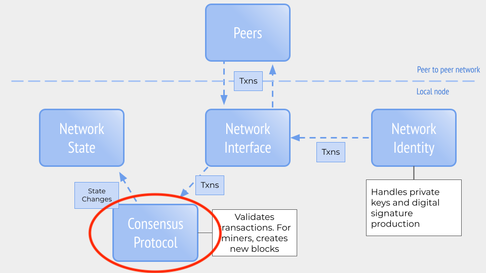

## A Brief History

Ever since the launch of Ethereum in 2015, there have been plans to update its core protocol significantly. In December 2015, five months after the launch of Ethereum mainnet, Vitalik Buterin [wrote a post describing the roadmap and eventual adoption of Ethereum 2.0:](https://blog.ethereum.org/2015/12/24/understanding-serenity-part-i-abstraction/)

*Buterin's post describing Ethereum roadmap, including Ethereum 2.0 AKA Serenity*  

As we've discussed earlier, Ethereum has been able to regularly update its protocol through multiple, coordinated network hard forks ([no small feat!](https://www.ccs.neu.edu/home/amislove/publications/Ethereum-HotNets.pdf)) to meet these roadmap requirements. However, these have primarily been upgrades _within_ the constructs of the Ethereum protocol originally formulated in the [Yellow Paper](https://ethereum.github.io/yellowpaper/paper.pdf) and launched in 2015\. Changes made to the protocol since 2015 can been seen as reactive adjustments to the realities of running a cryptocurrency network. If we were to think of the Ethereum network as a house, launch of Ethereum mainnet was the building of the house and everyone moving in. Network forks are the patches, repairs and additional features to address challenges that arise from more people moving into the house. The upgrade to Ethereum 2.0 ("Serenity" on the roadmap) will be akin to building an entirely new foundation and house to accommodate the next generation of network growth. 

(With regards to the mental model we've discussed earlier, the Ethereum 2.0 migration is an updating of the consensus mechanism, as circled below:)

But we have this huge community and entire businesses in the current Ethereum home (called "Ethereum 1.x"). We can't risk moving everyone in to an entirely new house and then discovering a catastrophic error. Therefore, Ethereum 2.0 is being introduced in a series of phases. Imagine the Ethereum 2.0 house being beside the Ethereum 1.x home. At first, there will be a path connecting the two. Ultimately, Ethereum 2.0 will expand to include Ethereum 1.x within it.

### Launch of Beacon Chain (Proof-of-Stake)

Phases 0 is the implementation of a Proof of Stake consensus mechanism for Ethereum. The blockchain secured by Phase 0's PoS mechanism is called the Beacon Chain. Miners for the Beacon Chain are called **validators**. 

In Proof of Work, miners must exert CPU to find a block and nonce that meets the difficulty. In Proof of Stake, the validators stake financial value to the blocks they propose and approve. They also are watching all the other validators to make sure no one is proposing incorrect blocks (containing errors or fraudulent activity). If a validator is caught proposing or confirming invalid blocks, they will be **slashed** (their financial stake is penalized). 

Phase 0 is the phase most public one now, as it's currently undergoing public testing and there are multiple companies developing software for it. Here is a list of the main validator clients:

* [Teku](https://pegasys.tech/teku/) — Java-based client developed by ConsenSys Software
* [Prysm](https://github.com/prysmaticlabs/prysm) — Go-based client developed by Prysmatic Labs
* [Lighthouse](https://github.com/sigp/lighthouse) — Rust-based client developed by Sigma Prime
* [Lodestar](https://github.com/ChainSafeSystems/lodestar_chain) — JavaScript-based client
* [Nimbus](https://github.com/status-im/nimbus) — Nim-based client developed by Status

The Medalla testnet was the first, public, multi-client testnet available. You can check out its progress [here](https://eth2stats.io/medalla-testnet) and join the testnet [by following these steps.](https://medalla.launchpad.ethereum.org/)

### Beacon Chain Launch

On October 14, 2020, the Beacon Chain deposit contract went live on Ethereum mainnet (L1) and people interested in validators could start locking up their ETH for validating using <a href="https://launchpad.ethereum.org/en/" target="_blank" rel="noopener noreferrer">Launchpad.</a>

On November 24, 2020, the minimum amount of ETH needed to start the Beacon Chain (524,288) was reached, which triggered the go-live mechanism to start the network in seven days.

On December 1st at 12pm UTC, the Beacon chain’s first blocks were validated. The first block came from <a href="https://beaconcha.in/validator/19026" target="_blank" rel="noopener noreferrer">Validator 19026,</a> with the enigmatic graffiti, “Mr F was here.” Twelve seconds later came the next block, graffiti indicating the validator might be located in <a href="https://beaconcha.in/blocks?q=BTCS+Zug+validator" target="_blank" rel="noopener noreferrer">Zug, Switzerland.</a> The Eth2 Beacon Chain grew steadily, block by block every 12 seconds. Then came the next hurdle: would enough validators be online to finalize the first Epoch? Yes! 82.27% of the validators attested to the validity of the Epoch 0, the proverbial ground floor of the Beacon Chain. You can see the latest blocks from the Beacon Chain on <a href="https://beaconcha.in/" target="_blank" rel="noopener noreferrer">Beaconcha.in.</a>

## Additional Material

Ethereum 2.0 development develops and matures day-by-day. It can be challenging to keep up with the bleeding edge of this exciting new network. Here are some resources below to help:

You can read the entire Ethereum 2.0 spec, including phases 0, 1 and 2 [here.](https://github.com/ethereum/eth2.0-specs)

- <a href="https://consensys.net/knowledge-base/ethereum-2/glossary/" target="_blank" rel="noopener noreferrer">Ethereum 2.0 Glossary (ConsenSys)</a>
- [Ethereum 2.0 Terms Demystified](https://medium.com/alethio/ethereum-2-0-terms-demystified-8398357429d7)
- <a href="https://consensys.net/knowledge-base/ethereum-2/" target="_blank" rel="noopener noreferrer">Ethereum 2.0 Knowledge Base</a>
- <a href="https://messari.io/pdf/messari-report-eth2-the-next-evolution-of-cryptoeconomy.pdf" target="_blank" rel="noopener noreferrer">Report: ETH2, The Next Evolution of Cryptoeconomy (Messari)</a>
- <a href="https://consensys.net/blog/blockchain-explained/my-journey-to-becoming-a-validator-on-ethereum-2-0/" target="_blank" rel="noopener noreferrer">My Journey to Becoming a Validator on Ethereum 2.0 — Part 1</a> Coogan walks through a four-part series of becoming a validator on Ethereum 2.0. Started before the Beacon Chain launched!
- To follow the progress of Ethereum 2.0, subscribe to [What's New in Eth2,](https://hackmd.io/@benjaminion/eth2_news/https%3A%2F%2Fhackmd.io%2F%40benjaminion%2Fwnie2_200822) which sends weekly updates.